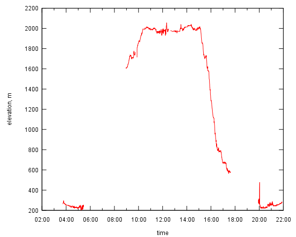
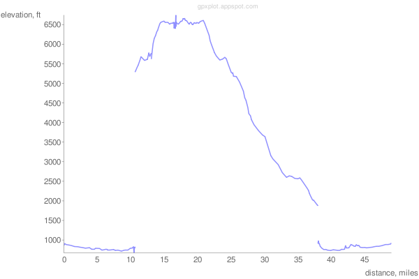

# gpxplot: Visualize elevation or velocity profile of GPS track

Automatically exported from code.google.com/p/gpxplot

This script can plot profiles of GPX tracks or prepare plot data for external tools.
Two types of profiles are currently supported: velocity and elevation (altitude)
as a function of time or distance travelled.
Multi-segment (non-continuous) GPS tracks are supported.

Normally, `gpxplot` reads GPX track and evaluates distance and velocity data.
It can print data in tabular form suitable for plotting by external plotting tools.
It can also plot trip profile directly using gnuplot (see options `-g` and `-o`).

Features:

 * using haversine formula to calculate distances (spherical Earth)
 * support of multi-segment (discontinuous) tracks
 * gnuplot support:
   * generate plots if gnuplot.py is available
   * generate gnuplot script if gnuplot.py is not available
 * plot interactively and plot-to-file modes
 * ~~Google Chart API support~~ _DEPRECATED_
   * ~~print URL or the plot~~ _DEPRECATED_
 * tabular track profile data can be generated
 * metric and English units
 * timezone support

~~You can also use `gpxplot` online, please check [gpxplot](http://gpxplot.appspot.com) page.
There is also [a simple API](http://code.google.com/p/gpxplot/source/detail?r=19) for the web script.~~

_The online version may stop working without notice,
because image-based Google Charts
[are deprecated](http://googledevelopers.blogspot.it/2012/04/changes-to-deprecation-policies-and-api.html)_

## Download

Current version: [gpxplot.py](https://raw.githubusercontent.com/astanin/gpxplot/master/gpxplot.py)

## Stand-alone program

```
Usage: gpxplot.py [action] [options] track.gpx

Actions:
-g            plot using gnuplot.py
--gprint      print gnuplot script to standard output
--google      print Google Chart URL
--table       print data table (default)

Options:
-h, --help    print this message
-E            use English units (metric units used by default)
-x var        plot var = { time | distance } against x-axis
-y var        plot var = { elevation | velocity } against y-axis
-o imagefile  save plot to image file (supported: PNG, JPG, EPS, SVG)
-t tzname     use local timezone tzname (e.g. 'Europe/Moscow')
-n N_points   reduce number of points in the plot to approximately N_points
```

## Online version (DEPRECATED)

Please visit [gpxplot.appspot.com](http://gpxplot.appspot.com/) to plot your GPX tracks online.
It should be straightforward, but online version is less powerful than the stand-alone script.
_This feauture is deprecated_

### Web API (DEPRECATED)

If you want to plot profiles for your tracks automatically,
but don't want to install the script, you can use web API.
Just put your GPX tracks online, and reference them in the request:

```
http://gpxplot.appspot.com/api/0.1.2/plot?gpxurl=URL_OF_YOUR_GPX_FILE&output=png
```

You can use this request URL as a URL of the image, for example:

```

```

Availability of this service is subject to free quotas on Google App Engine.
Also, Google App Engine is not very good at processing big files (1 MB and more).
Incompatible changes to the API correspond will be reflected in the second version number (0.*1*.2 ⇒ 0.*2*.0).

Web API versions:
[0.1](https://github.com/astanin/gpxplot/commit/4a5c9e6702916b25e42e7967cb52a1f0bcab5a9a),
[0.1.1](https://github.com/astanin/gpxplot/commit/fa5801bc091b6432d4d18b1c99da4d4becc8f460),
[0.1.2](https://github.com/astanin/gpxplot/commit/3dba6769fc160b6cbe5b4a16b644fa22778b52a3).

## Examples

If you run gpxplot like this:

```
$ ./gpxplot.py -g -x time -y elevation test.gpx
```

it will try to plot elevation-against-time profile for given track.
You need [gnuplot.py](http://gnuplot-py.sourceforge.net/) installed run this example.
A new window with a plot will open.

If you have only `gnuplot` installed, but not `gnuplot.py`, you can print the gnuplot script to standard output.
In this case run `gnuplot` manually like this:

```
$ ./gpxplot.py --gprint -x time -y elevation test.gpx | gnuplot -persist -
```

To save the plot to file use `-o filename`:

```
./gpxplot.py -g -x time -y elevation -o track.svg test.gpx
```

The plot generated may look like this:



To plot using Google Chart API use `--google`:

```
./gpxplot.py --google -n 200 -E test.gpx
```

It will print a long URL, which points to the PNG image with a plot:



A small tip: unix shell considers “&” symbols in the URL as an “end of command” markers.
To avoid it, quote the URL properly in shell scripts.
For example, to view the plot in the browser, the shell command is

```
firefox "$(gpxplot.py -google -n 200 -E test.gpx)"
```

Please note that the number of points was reduced to approximately 200 (option `-n 200`)
and the units are miles/feet (option `-E`).

## Tips & Tricks

  * Please note that time or elevation data may be missing from the GPX file.
    Such tracks may be produced, for example, by Garmin devices,
    if you use their [Save track](http://www.gpsmap.net/GarminHints.html#GarminSaveFunction) function
    (use their ACTIVE LOG instead).
    Track files without time data cannot be used to plot velocity or time profiles.

  * Preprocessing tracks with [gpsbabel](http://www.gpsbabel.org/) is a good idea.
    For example, this would remove many ``wrong'' points from the track:

    ```
    gpsbabel -t -i gpx -f original-track.gpx -x discard,hdop=3,vdop=3 -o gpx -F fixed-track.gpx
    ```

  * Saving images to vector graphics formats (SVG, EPS) may produce higher quality plots.

  * You can smooth and average your track with gpsbabel before plotting with gpxplot.
    Two gpsbabel filters are especially useful: `-x simplify,count=N` (to reduce number of points)
    and `-x position,distance=Nm` (to increase minimal distance between track points to N meters).

  * gpxplot may be used in unix pipes, a special filename "-" means that the data (GPX file)
    is to be read from stdin. For instance:

    ```
    cat my-track.gpx | \
    gpsbabel -i gpx -f - -x position,distance=100m -o gpx -F - | \
    gpxplot.py --gprint -x dist -y vel - | \
    gnuplot -persist -
    ```
